## Object Detection Tutorial

Object detection api kuruluma başlamadan https://www.anaconda.com/products/individual adresinden 
anaconda indirip kurulumunu yapalım. 
Daha sonra komut istemini açalım. Burada "conda create -n tod python==3.6.5" yazalım. 
Bu şekidle python 3.6.5 kurulu yeni bir enviroment oluşturduk. 
Envirometi aktif etmek için "conda activate tod" yazalım. Tüm işlemlerimizi bu enviroment içerisinde yapacağız. 

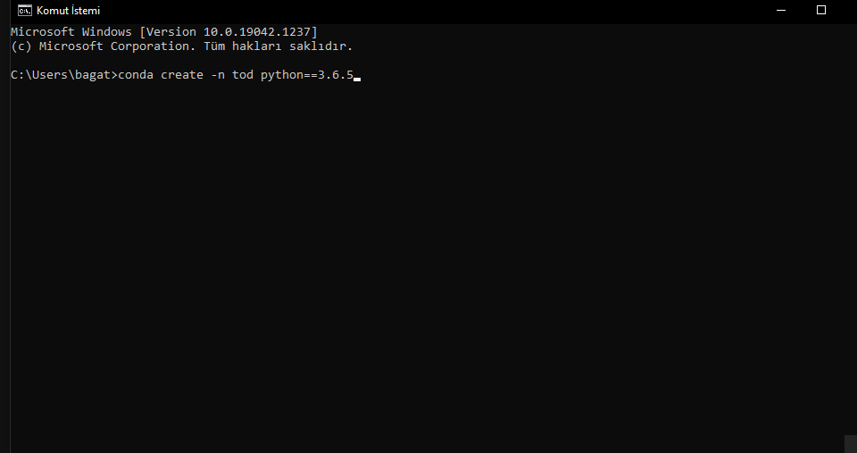
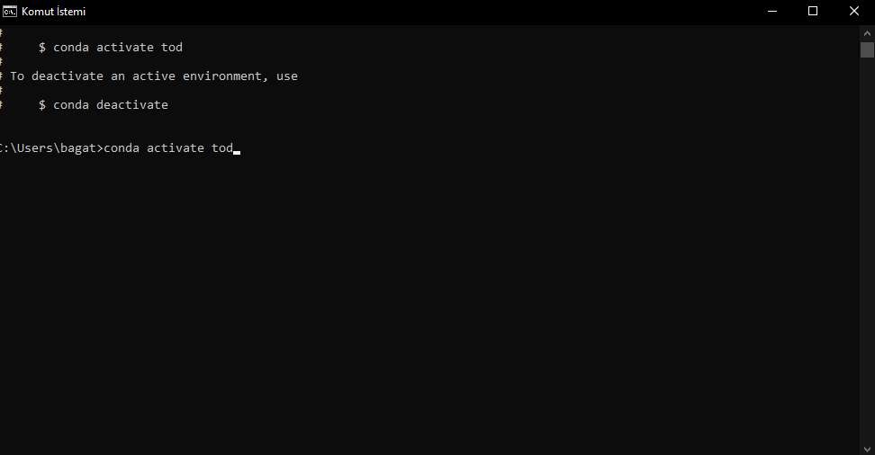

## Tensorflow Kurulumu 
Object detection Api kullanmak için tensorflow kurumuna ihtiyacımız var. Oluşturduğumuz enviromente "pip install --ignore-installed --upgrade tensorflow==2.6.0" komutunu kullanarak tensorflow kütüphanesi kuralım.

### Gpu Desteği
Eğitimlerimizin hızlı bir şekilde olması için gpu kullanmak çok daha faydalı olacaktır. 
GPU kullanarak eğitimleri yapmak için CUDA ve CuDNN kurulumlarını yapmamız gerekiyor. 
İnternetti bir çok videodan ve yazıdan kurulumların nasıl yapılacağına bakabilirsiniz. 
Tensorflow versiyonunuza uygun CUDA ve CuDNN aşağıdaki linklerden indirip kurulumları yapalım.
Tensorflow 2.6.0 için CUDA Toolkit 11.2 ve CuDNN 8.1 kurulumlarını yapmamız gerekiyor.  
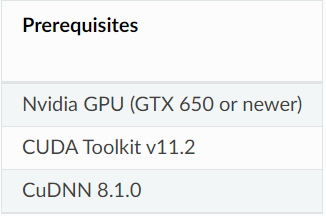
CUDA : https://developer.nvidia.com/cuda-11.2.2-download-archive?target_os=Windows&target_arch=x86_64&target_version=10&target_type=exenetwork  
CuDNN : https://developer.nvidia.com/rdp/cudnn-download

### Kurulum Testi 
Kurulumu test etmek için enviromenti aktif ettikten sonra
import tensorflow as tf  
tensorflow.test.is_gpu_available()  
yazabilirsiniz. Eğer dönen sonuç True is kurulumunuz başarılı olmuştur. 
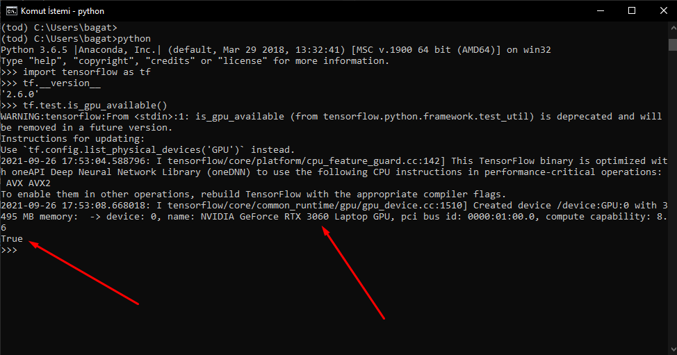

## Tensorflow Object Detection API
Buraya kadar tensorflow kurulumunu tamamladık. Bundan sonra Tensorflow Object Detection Api kurulumunu yapacağız.  

Projemizi kuracağımız bir klasör oluşturun. Ben objectdetectionapi adında bir klasör oluşturdum. 
Daha sonra bunun içerisine Tensorflow adında bir klasör oluşturalım. Burada verdiğimiz isimler önemsiz ama aynı şekilde ilerlemek için bu şekilde oluşturabilirsiniz.  
"C:\Users\bagat\Desktop\ObjectDetectionAPI\Tensorflow"  

https://github.com/tensorflow/models reposunu ya git clone komutu ile yada direkt zip olarak indirelim. Bu indirdiğimiz dosyaları "Tensorflow" klasörüne çıkaralım. 
Mevcut durumda klasör görümünüz aşağıdaki gibi olması gerekiyor. 

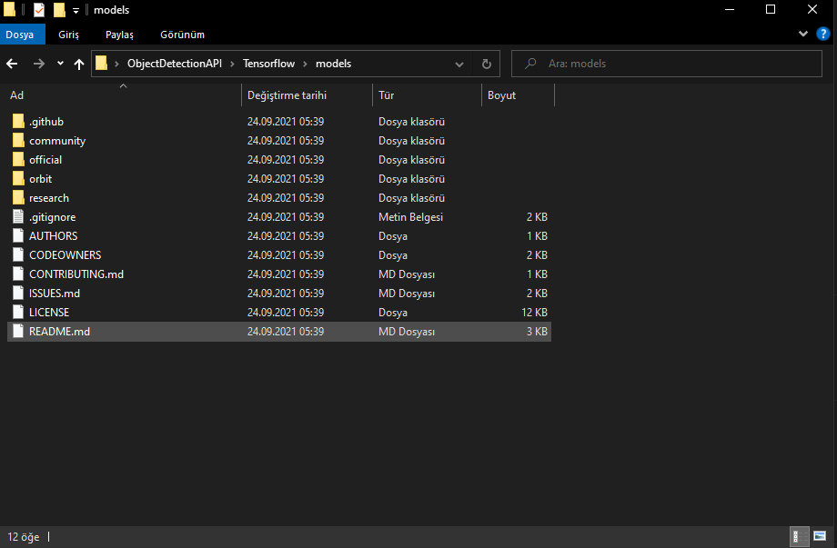

### Protobuf İndirilmesi ve Kullanılması  
https://github.com/google/protobuf/releases adresinden win64 için uygun olan protobuf dosyasını indirelim. 
Bu indirdiğimiz zip dosyasını uygun bir yere çıkartalım. Daha sonra bu dosyanın içersindeki bin klasörünü ortam değişkenlerinden pathe ekleyelim.  
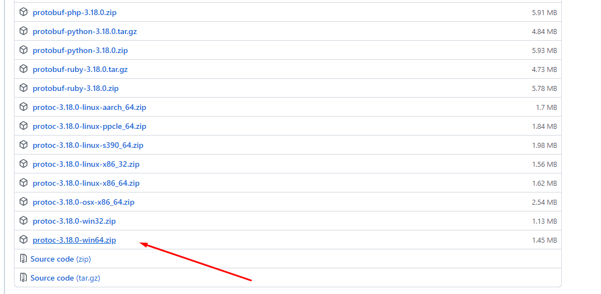  
Daha sonra komut isteminden "TensorFlow/models/research/" klasörüne gidelim ve aşağıdaki komutu çalıştıralım. 
"protoc object_detection/protos/*.proto --python_out=."  
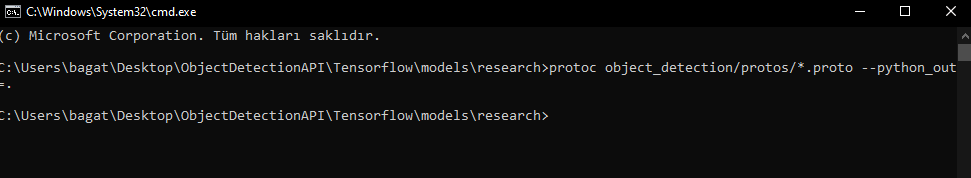  

## COCO API Kurulumu 
TensorFlow 2.x sürümünden bu yana "pycocotools" paketi Object Detection Api kullanmak için zorunlu hale getirildi. Kurulumu için aşağıda komutları terminalden çalıştıralım.  
pip install cython  
pip install git+https://github.com/philferriere/cocoapi.git#subdirectory=PythonAPI  

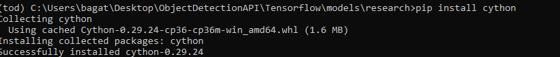  
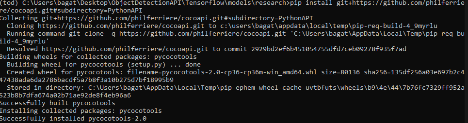  

## Object Detection Api Kurulumu 
Object detection api kurumunu tamamlamak için object detection paketini kurmamız gerekiyor. Bunun için aşağıdaki komutları "TensorFlow/models/research/" klasörünün içindeyken çalıştıralım.  
copy object_detection/packages/tf2/setup.py .
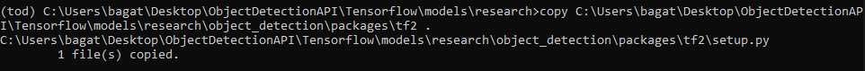 
python -m pip install --use-feature=2020-resolver .
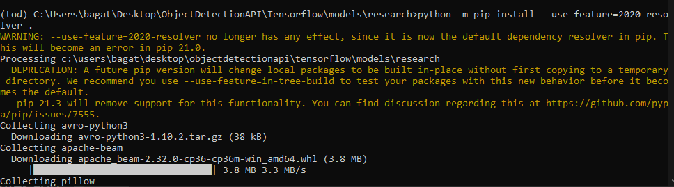 

## Kurulum Testi 
Yaptığımı kurulumu test etmek içim aşağıdak komut satırını çalıştıralım. Burada bir takım testler yapılıyor ve sonucunda OK görüyorsanız tebrikler kurulumu başarı ile tamamladınız. 
python object_detection/builders/model_builder_tf2_test.py  
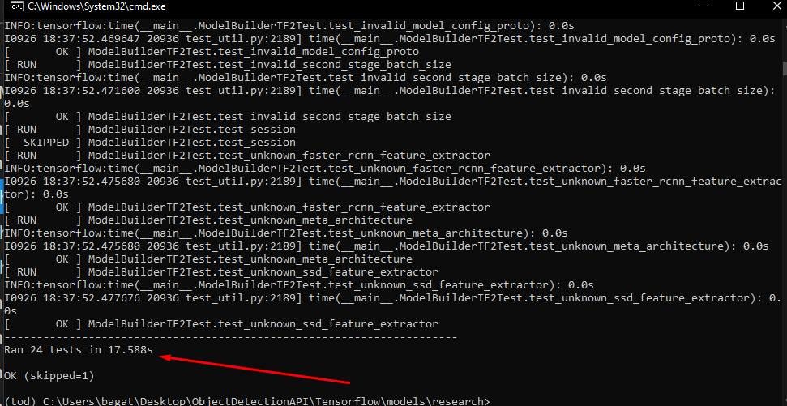 

## Custom Object Detection 
Tüm kurulumları yaptığımıza göre kendi datalarmızla object detection yapabiliriz.
Bunun için aşağıdaki gibi bir klasör düzeni oluşturalım.  
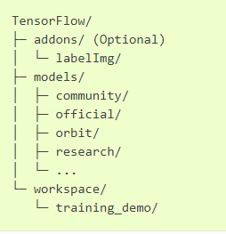 
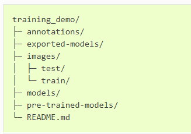

- annotations: Csv dosyaları ve .record dosyalarını bu klasörde tutacağız. 

- exported-models: Eğittiğimiz modelleri tutmak için kullancağız. 

- images: Veri setimizdeki tüm resimler burada tutulacak bunların xml dosyaları da burada bulunacak. 

- images/train: Eğitim için gerekli olan imageler ve xml dosyaları tutulacak. 

- images/test: Test için gerekli olan imageler ve xml dosyaları tutulacak. 

- models: Eğitim sırasında üretilen dosyalar ve config dosyaları burada tutulacak. 

- pre-trained-models: İndirdiğimi önceden eğitilmiş modelleri tutmak için kullanacağız. 

## Veri Setinin Hazırlanması 
LabelImg kullanarak topladığımız verileri etiketleyebiliriz. Kullanımı için internette videolar bulunuyor. Bunlara bakarak nasıl kullanılacağına bakabilirsiniz. 
pip install labelImg yazar ve ardından labelImg yazarak uygulamayı açabilirsiniz. 
Burada etiketleyeceğimiz resimlerin olduğu klasörü seçelim ve etiketlemeye başlayalım. 

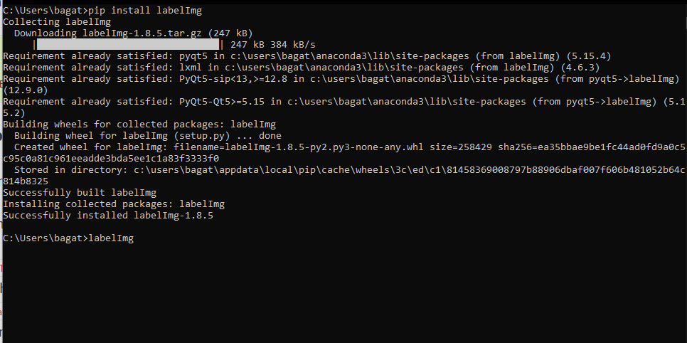 
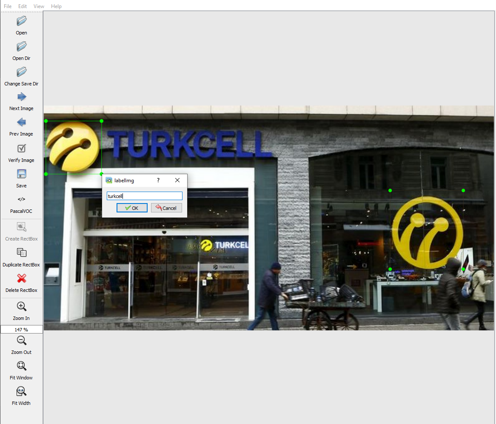 

### Labelmap Oluşturma 
Kullandığımız etiketleri tam sayı olacak şekilde yazağımız bir labelmap dosyası oluşturalım.
Bu dosyanın içerisine aşağıdaki gibi yazalım.  
training_demo/annotations altıda label_map adında .pbtxt uzantılı bir dosya oluşturup içine aşağıdaki gibi yazalım. 

item {
    id: 1
    name: 'turkcell'
}

## Tensorflow Recordların Oluşturulması 

Xml dosyalarını tensorflow record dosyalarına çevireceğiz. Bunun için generate_tfrecord.py dosyasını kullanacağız. Bunu github reposunda Tensorflow/scripts kısmında bulabilirsiniz. 
Bu dosyanın olduğu yerde bir terminal açalım ve aşağıdaki komutları yazalım.   

python generate_tfrecord.py -x [PATH_TO_IMAGES_FOLDER]/train -l [PATH_TO_ANNOTATIONS_FOLDER]/label_map.pbtxt -o [PATH_TO_ANNOTATIONS_FOLDER]/train.record  

python generate_tfrecord.py -x [PATH_TO_IMAGES_FOLDER]/test -l [PATH_TO_ANNOTATIONS_FOLDER]/label_map.pbtxt -o [PATH_TO_ANNOTATIONS_FOLDER]/test.record

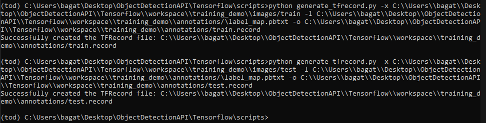 

# Pre-Trained Model İndirilmesi 

Aşağıdaki linkten önceden eğitilmiş modellerden bizim için en uygun olanı seçiyoruz. Burada precision ve speed değerlerine bakarak bize uygun olacak "SSD ResNet50 V1 FPN 640x640" modelini indirebiliriz. İndirdiğimiz modeli aşağıdaki klasör yoluna çıkartalım. 
https://github.com/tensorflow/models/blob/master/research/object_detection/g3doc/tf2_detection_zoo.md 
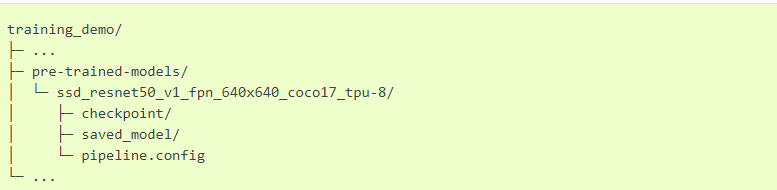 
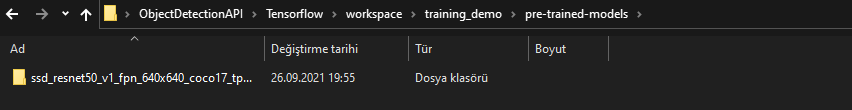 

## Eğitim İçin Pipeline hazırlanması

Pre-trained modeli çıkarttık. Bunu kullanarak kendi pipelineımız ile eğitimi yapacağız. Ancak öncesinde pipeline.config doyasında düzenlemeler yapmamız gerekiyor. trainind_demo/models altına my_ssd_resnet50_v1_fpn adında yeni bir klasör oluşturup config dosyasını buraya kopyalayıp açalım.

Direkt hazır olarak githubdan indirip yolları kendinize göre düzenleyebilirsiniz.

## Model Eğitimi

Sonunda eğitimi başlatacağımız kısma geldik. Config dosyasında yaptığımı düzenlemelerden sonra ben 5000 adım olacak şekilde eğitimi başlatıyorum. Step sayısını arttırarak daha iyi sonuçlar alabilirsiniz.  
TensorFlow/models/research/object_detection/model_main_tf2.py dosyasını training_demo ya kopyalayıp eğitimi başlatabilirsiniz. 

python model_main_tf2.py --model_dir=models/my_ssd_resnet50_v1_fpn --pipeline_config_path=models/my_ssd_resnet50_v1_fpn/pipeline.config  
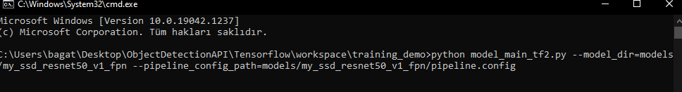 
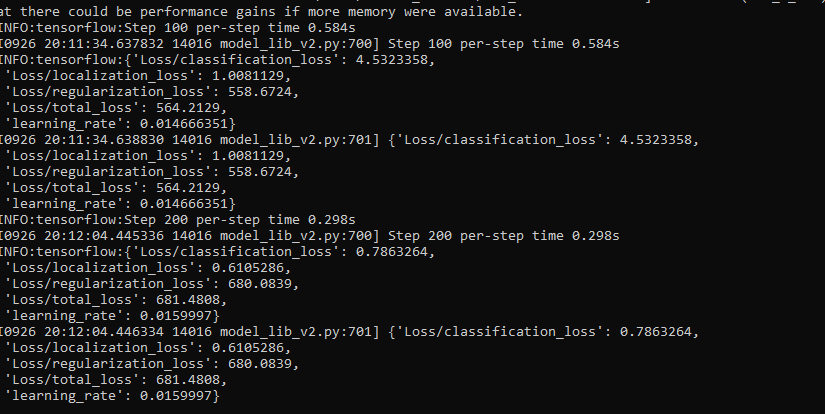 

## Eğitilmiş Modelin Kullanılması
Eğitim bittikten sonra object detection yapabilmek için inference graph oluşturmamız gerekiyor. 
Bunun için TensorFlow/models/research/object_detection/exporter_main_v2.py dosyasını training_demo altına kopyalayım.  Aşağıdaki komutu kullanarak exported-models altına modelimi çıkartalım.  
python .\exporter_main_v2.py --input_type image_tensor --pipeline_config_path .\models\my_ssd_resnet50_v1_fpn\pipeline.config --trained_checkpoint_dir .\models\my_ssd_resnet50_v1_fpn\ --output_directory .\exported-models\my_model

## Modeli Deneyelim 
Eğitilmiş modelimizi test etmek için "Tensorflow\detectionplot_object_detection_saved_model.ipynb" jupyter notebookunu açalım ve testimizi gerçekleştirelim. Resimlerde görüldüğü gibi Turkcell logolarını doğru bir şekilde detect edebildik. 

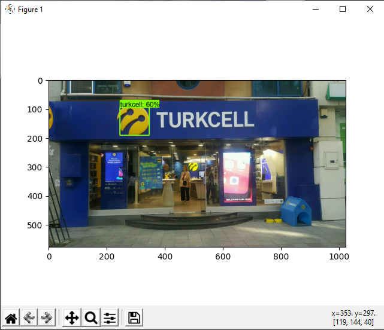 
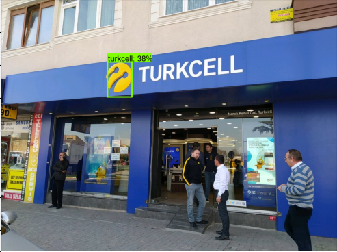 
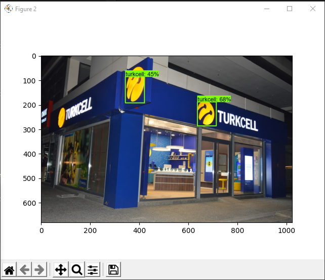 

# ÖZET 
Modeli daha uzun süre çalıştırırsak muhtemelen daha iyi sonuçlar elde edebilriiz. Eğitim için toplamda 26 fotoğraf kullandık bunların sayısını artırarak da daha iyi sonuçlar elde edebiliriz. Burada gördüğünüz şekilde verileri etiketleyip istediğiniz bir çok şeyi detect etmeniz zor olmayacaktır. 